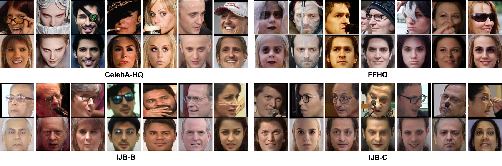
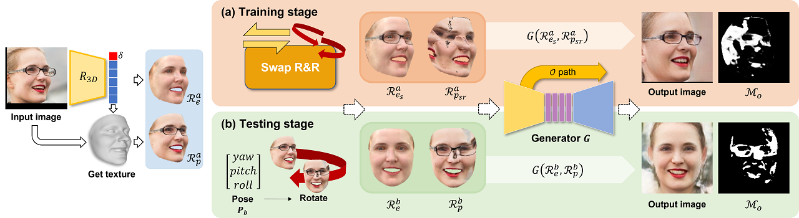
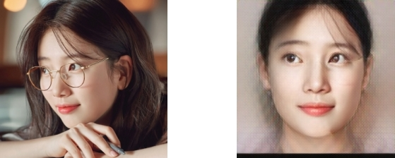

## Complete Face Recovery GAN: Unsupervised Joint Face Rotation and De-Occlusion from a Single-View Image (WACV 2022)
> [Yeong-Joon Ju](https://github.com/yeongjoonJu), Gun-Hee Lee, Jung-Ho Hong, and Seong-Whan Lee

[[Video]](https://www.youtube.com/watch?v=NVm4MzqvgO0) [[Paper]](https://openaccess.thecvf.com/content/WACV2022/html/Ju_Complete_Face_Recovery_GAN_Unsupervised_Joint_Face_Rotation_and_De-Occlusion_WACV_2022_paper.html)

Below images are frontalization and de-occlusion results. The first rows are the input images and the second rows are our results. We crop the results as alignments for input images of facial recognition networks.

**Training codes for occlusion robust 3D face reconstruction in this paper are available in [here](https://github.com/yeongjoonJu/Occlusion-Robust-3D-Face-CFR-GAN).**

## Abstract

We present a self-supervision strategy called Swap-R&R to overcome the lack of ground-truth in a fully unsupervised manner for joint face rotation and de-occlusion. To generate an input pair for self-supervision, we transfer the occlusion from a face in an image to an estimated 3D face and create a damaged face image, as if rotated from a different pose by rotating twice with the roughly de-occluded face. Furthermore, we propose Complete Face Recovery GAN (CFR-GAN) to restore the collapsed textures and disappeared occlusion areas by leveraging the structural and textural differences between two rendered images. Unlike previous works, which have selected occlusion-free images to obtain ground-truths, our approach does not require human intervention and paired data.

## Quick start

*Please read the document to the end before attempting with your images.*

Our code was implemented in Ubuntu 16.04 and 18.04. So this code may not support any OS other than Linux OS

1) Download [our trained weights](https://koreaoffice-my.sharepoint.com/:u:/g/personal/yj_ju_korea_ac_kr/EfiKe0BrN6JPo9sr_FX8JncBAtUBg7W0QiYi3ys39HkAiw?e=7nC08r).

2) Download BFM_model_80.mat and 3D face estimator weights [here](https://github.com/yeongjoonJu/Occlusion-Robust-3D-Face-CFR-GAN/blob/main/readme.md).

**Generate de-occluded and rotated face images given a pose.**

~~~bash
python inference.py --img_path test_imgs/input --save_path test_imgs/output --generator_path [saved_path] --estimator_path [saved_path]
~~~

**Generate training data pairs from your data!!**

~~~
python generate_pair.py
~~~

Please check parameters of main in the code.

**!! If you want to use your images, you should align images. Please refer to [this repo](https://github.com/yeongjoonJu/Occlusion-Robust-3D-Face-CFR-GAN) for alignment. !!**

**Inference for non-aligned facial images**

For alignment, You can use MTCNN or RetinaFace but we recommend to use [RetinaFace](https://github.com/biubug6/Pytorch_Retinaface).

~~~bash
git clone https://github.com/biubug6/Pytorch_Retinaface.git
mkdir Pytorch_Retinaface/weights
Download weights
python inference.py --img_path [your image path] --save_path [your save path] --generator_path [saved_path] --estimator_path [saved_path] --aligner retinaface
~~~

## Citation

~~~
@InProceedings{Ju_2022_WACV,
    author    = {Ju, Yeong-Joon and Lee, Gun-Hee and Hong, Jung-Ho and Lee, Seong-Whan},
    title     = {Complete Face Recovery GAN: Unsupervised Joint Face Rotation and De-Occlusion From a Single-View Image},
    booktitle = {Proceedings of the IEEE/CVF Winter Conference on Applications of Computer Vision (WACV)},
    month     = {January},
    year      = {2022},
    pages     = {3711-3721}
}
~~~

## Acknowledgement

1. This work was supported by Institute of Information & communications Technology Planning Evaluation (IITP) grant funded by the Korea government(MSIT) (No. 2019-0-00079, Artificial Intelligence Graduate School Program(Korea University))

2. This work was supported by Institute for Information & communications Technology Promotion(IITP) grant funded by the Korea government(MSIT) (No.2019-0-01371, Development of brain-inspired AI with human-like intelligence).
